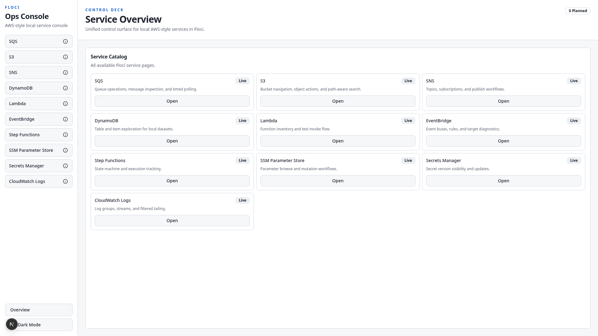
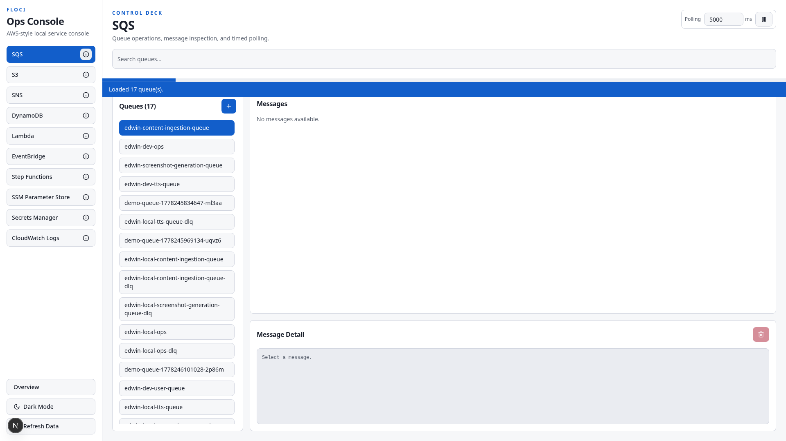
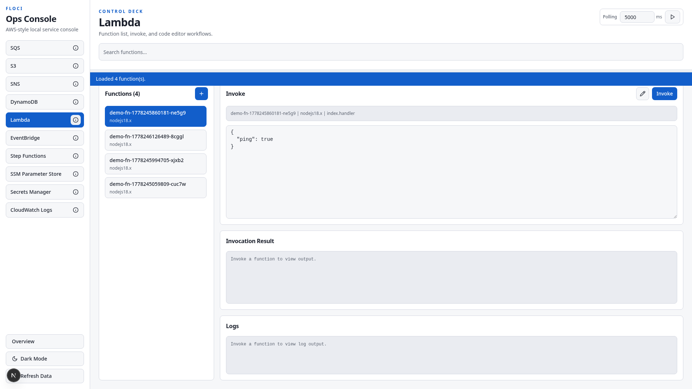
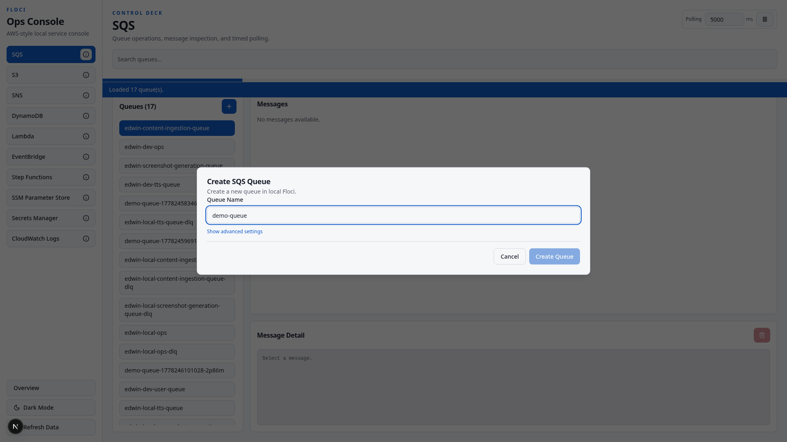
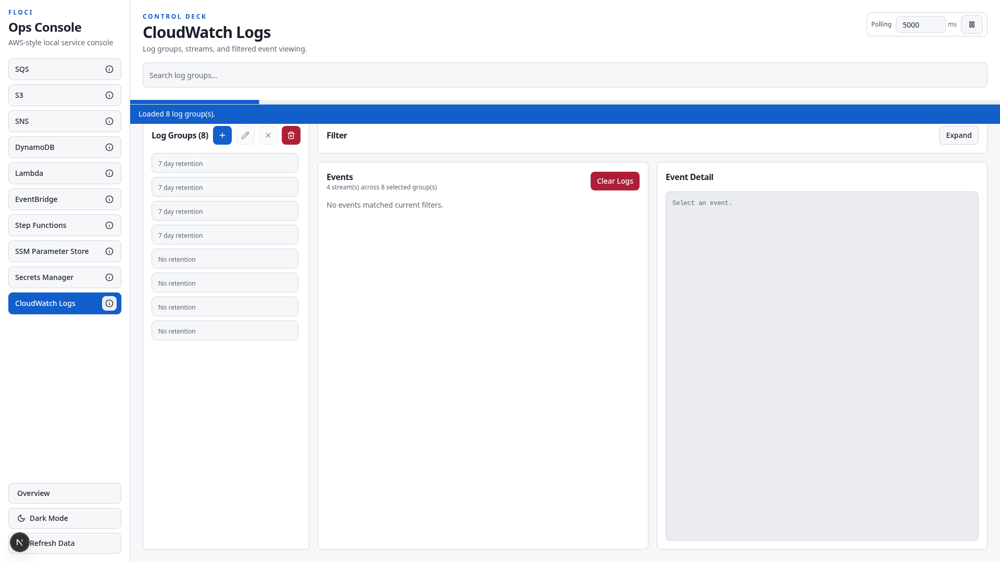

# Floci UI

Floci UI is a Next.js control plane for local AWS-style environments powered by Floci. It gives you one place to browse resources, create new ones, and run common operational workflows across services.

## Capabilities

- Service coverage:
  - SQS
  - S3
  - SNS
  - DynamoDB
  - Lambda
  - EventBridge
  - Step Functions
  - SSM Parameter Store
  - Secrets Manager
  - CloudWatch Logs
- Unified service shell with search, refresh, and optional polling controls.
- Resource creation workflows across all listed services.
- Friendly create-error mapping for common API failures.
- Lambda invoke flow with payload, response, and logs.
- Lambda source loading support from local Floci data mounts.
- Route-handler proxy for Floci via `/floci/*`.
- Service-level feature flags via `FLOCI_ENABLED_SERVICES`.

## Quick Start

1. Ensure Floci is running (default: `http://localhost:4566`).
2. Install dependencies:

```bash
npm install
```

3. Start the app:

```bash
npm run dev
```

4. Open `http://localhost:4173`.

## Configuration

| Variable | Scope | Default | Purpose |
| --- | --- | --- | --- |
| `FLOCI_ORIGIN` | Server | `http://localhost:4566` | Upstream target for `/floci/*` proxy and health reporting. |
| `FLOCI_ENABLED_SERVICES` | Server | `*` | Comma-separated service slugs to expose. Disabled services are hidden and return `404`. |
| `NEXT_PUBLIC_FLOCI_SQS_ACCOUNT_ID` | Client | `000000000000` | Account id fallback for SQS queue URL operations. |
| `NEXT_PUBLIC_FLOCI_SQS_POLL_MS` | Client | `5000` | Default SQS polling interval in milliseconds. |
| `NEXT_PUBLIC_APP_VERSION` | Client | `dev` | Current app build version used by the update check banner. |
| `VERSION_MANIFEST_URL` | Server | `/version.json` | URL to the deployed version manifest (for example GitHub Pages `version.json`). |
| `FLOCI_LOCAL_DATA_PATH` | Server | unset | Optional base path for Lambda local source files (used by `/api/lambda-source/[name]`). |

### Version Update Changes List

- The update banner reads `changes` from `version.json` via `/api/version-manifest`.
- `changes` is published by `.github/workflows/publish-image.yml` as an array of strings.
- For `workflow_dispatch`, set `update_changes` as newline-delimited items to publish release notes in the banner.
- For branch `push` runs (`main`/`dev`), `changes` defaults to an empty array.

## Endpoints

- `GET /healthz` returns:

```json
{ "ok": true, "flociOrigin": "http://localhost:4566" }
```

- `/floci/*` proxies HTTP methods to `FLOCI_ORIGIN`.

## Routes

- `/`
- `/sqs`
- `/s3`
- `/sns`
- `/dynamodb`
- `/lambda`
- `/eventbridge`
- `/step-functions`
- `/ssm`
- `/secrets-manager`
- `/cloudwatch`

## Usage Examples

### 1) Run only selected services

```bash
FLOCI_ENABLED_SERVICES=sqs,s3,cloudwatch npm run dev
```

### 2) Validate upstream connectivity

```bash
curl -s http://localhost:4173/healthz
```

Expected shape:

```json
{ "ok": true, "flociOrigin": "http://localhost:4566" }
```

### 3) SQS create flow

1. Open `/sqs`.
2. Click the create queue button.
3. Enter a queue name.
4. Confirm create and verify the queue appears in the left list.

### 4) Lambda invoke flow

1. Open `/lambda`.
2. Select a function.
3. Provide JSON payload.
4. Run invoke and review result + logs in the output panel.

## Screenshots

All screenshots below were captured with Playwright against `http://localhost:4173` with sensitive UI elements redacted during capture.

## Demo Video

Latest Playwright demo capture (1920x1080, captioned, compressed):

- [Demo Video (MP4)](public/readme/demo.mp4)

### Overview



### SQS



### Lambda



### Create Dialog



### CloudWatch Logs



## Testing

Playwright end-to-end coverage is under `tests/e2e/create-workflows.spec.ts`.

Install browsers:

```bash
npx playwright install
```

Run e2e (gated):

```bash
RUN_FLOCI_E2E=1 npm run test:e2e
```

Notes:
- Tests are intentionally gated behind `RUN_FLOCI_E2E=1`.
- Playwright starts the Next.js app via `webServer` unless you override base URL.
- Optional override: `PLAYWRIGHT_BASE_URL`.

## Build and Run

```bash
npm run build
npm run start
```

## Docker

Build:

```bash
docker build -t floci-ui:local .
```

Run:

```bash
docker run --rm -p 4173:4173 \
  -e FLOCI_ORIGIN=http://host.docker.internal:4566 \
  -e FLOCI_ENABLED_SERVICES=sqs,s3,cloudwatch \
  floci-ui:local
```
